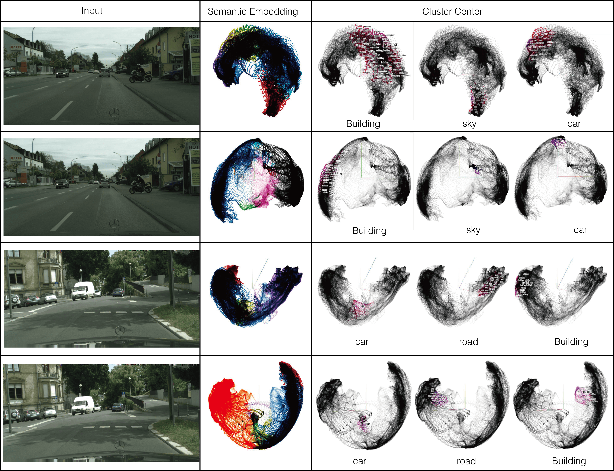

# Embedding-Interaction based Panoptic Segmentation

#####  

[Paper](https://github.com/Wastoon/EIPSNet)   [Appendix](https://github.com/Wastoon/EIPSNet)    [Code](https://github.com/Wastoon/EIPSNet)

In this repo, we  propose a panoptic segmentation model based on **embedding interaction mechanism**, which greatly enhance semantic embedding and instance embedding of decoder of semantic branch and instance branch. Meanwhile, we apply the enhanced instance embedding to learn the unique representation of instance, which is used to re-group instance from semantic segmentation under the bottom-up framework. Therefore, proposed  embedding interaction mechanism not only augment both semantic embedding and instance embedding, but also produce a new instance assembly clue for bottom-up panoptic segmentation without too many intermediate results.

Our motivation comes from the figure below.

As a result, Embedding-Interaction based Panoptic Segmentation (EINet) achieves superior results on Cityscapes and COCO datasets. The results clearly show the feasibility of joint optimization for panoptic segmentation through designed embedding interaction mechanism without using too many intermediate results.

The whole training propcess of EINet is as follows:

. 

And the core of Interaction Mechanism is as follows:

. 

And the details of Encoder and Decoders of EINet is as follows:

. 

## Qualitative Evaluaton

### A.1. Visualization of Panoptic Segmentation on COCO with ResNet50.

. 

Visualization of panoptic segmentation on COCO with ResNet50. Left to right: input image, results by [Detectron2](), results by [PanopticDeeplab](), ours results through EINet.

### A.2. Visualization of Panoptic Segmentation on Cityscapes with ResNet50.

. 

Left to right: input image, results by [PanopticDeeplab](), results by EINet(**ours**)). 

### A.3. Visualization of Learned Centroid of Instance.

. 

Visualization of panoptic segmentation results of EINet on Cityscapes val dataset with ResNet50. Left to right: input image, instance segmentation results with scale-adaptive centroid heatmap, panoptic segmentation results.

### A.4 Semantic Embedding Visualization

. 

Visualization of Semantic Embedding on Cityscapes dataset. The **odd** rows are the results of Semantic Embedding **without interaction**, and the **even** rows are the results of **interaction-augmented** Semantic Embedding. 

## Acknowledgements

We have used utility functions from other open-source projects. We espeicially thank the authors of:

+ [Detectron2](https://github.com/facebookresearch/detectron2)
+ [Object-as-point](https://github.com/xingyizhou/CenterNet)
+ [PanopticDeeplab](https://github.com/bowenc0221/panoptic-deeplab)

